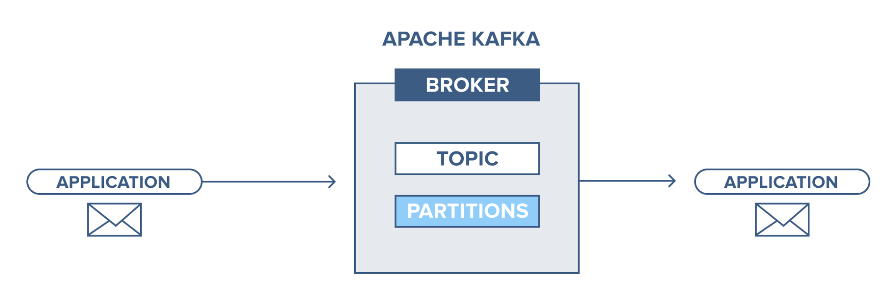
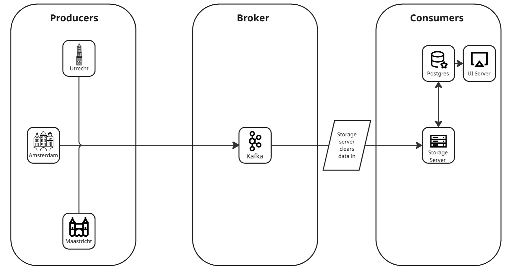

# 1-4-group-project
Year 1 Block 4 group project repo.

By Robert, Axel, Raydi & Hafize

# Overview

This repo simulates a typical Kafka Ecosystem, where producers load messages into the Kafka Broker, while a consumer listens for them.

 

Our Simulation consists of 5 elements:
* Kafka broker (Docker)
* PostgreSQL DB (Docker)
* Storing Microservice (./storage_server)
* Data producing nodes (./node)
* Flask Dashboard (./dashboard)

 

# Getting started

1. Install python dependencies 

```
pip install -r requirements.txt
```

2. Create docker container

```
docker-compose up
```

Make sure that the ports 5432 and 9092 are free.

# Running the simulation

1. Launch storage server

```
cd .\storage_server\  

py .\storage_server.py
```
The server will try and connect to Kafka, generate a set of topics and await for messages.

2. Run nodes

In a new terminal:

```
cd .\node\  

py .\run_nodes.py
```
This script will create 3 nodes, who will each upload data from the files in raw_data, and publish it on Kafka.

3. Check the storage server

Once the nodes have uploaded their data, the node will start processing them one by one.

From an initial set of 6 files (each, basically a table), the data will end up in 10 tables. (More info in our normalization rationale)

4. Launch the dashboard

```
cd .\dashboard\  

py .\app.py
```
The app will deploy on port 5000.

It can be reached on http://127.0.0.1:5000

The dashboard will display the result of 5 queries from the normalized data.


## Testing Scripts

From the repo root:

Add Topic:

```
docker-compose exec kafka kafka-topics.sh --create --topic test-topic --partitions 1 --replication-factor 1 --if-not-exists --bootstrap-server localhost:9092
```

List Topics:
```
docker-compose exec kafka kafka-topics.sh --list --bootstrap-server localhost:9092
```